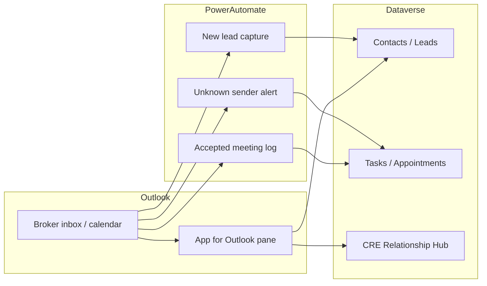

# Phase 3 — Outlook-First Workflow

**Status: Complete** (GitHub issue [#4](https://github.com/sandeep-stw/Demo_01_crm_setup/issues/4))

Brokers complete everyday CRM tasks from Outlook using **Dynamics 365 App for Outlook**, email tracking, and supporting Power Automate flows.

## What is automated in this repo

| Component | Script / config | Purpose |
| --- | --- | --- |
| **CRE - Log Accepted Meeting to CRM** | `config/cre-outlook-workflows.json`, `scripts/deploy-cre-outlook-workflows.py` | When a broker accepts an Outlook calendar event, create **appointment** activities on matching **contact** records |
| **CRE - Alert Unknown Email Sender** | same | When inbound email is from an address not in contacts/leads, create a **task** for the broker to review and create a contact |
| **App for Outlook prerequisites** | `config/cre-outlook-app.json`, `scripts/deploy-cre-outlook-app.py` | Verify CRE Relationship Hub app, enable org email tracking, configure broker mailbox for server-side sync |
| **Shared flow utilities** | `scripts/cre_flow_deploy.py` | Connection refs, workflow upsert, solution registration |

Deploy everything (including Phase 3):

```bash
./scripts/deploy-cre-solution.sh
```

Or Phase 3 only (after CRE model/app are deployed):

```bash
python3 ./scripts/deploy-cre-outlook-workflows.py
python3 ./scripts/deploy-cre-outlook-app.py
python3 ./scripts/register-cre-solution-components.py
```

## App for Outlook capabilities (broker experience)

After rollout, brokers can use App for Outlook to:

- **Track email** to contact, account, opportunity, and property records
- **Create contacts** from email signatures (App for Outlook quick create)
- **Create opportunities** from email context
- **Associate emails** with deals, properties, and companies
- **Schedule meetings** linked to CRM records
- **Create follow-up tasks** from the Outlook pane
- View **activity history**, related contacts, and open opportunities in the sidebar
- Get **record suggestions** for incoming email senders (App for Outlook matching)

These features are provided by the **Dynamics 365 App for Outlook** add-in paired with the **CRE Relationship Hub** model-driven app — not by custom code in this repository.

## One-time activation (required)

### 1. Power Automate flows

Each flow deploys in **draft**. For every flow in **Solutions → CRE Relationship Management**:

1. Open the flow in edit mode
2. Sign in to **Office 365 Outlook** and **Microsoft Dataverse** connections
3. Save and turn the flow **On**

Flows to activate:

- CRE - Email New Lead to CRM (Phase 1)
- CRE - Log Accepted Meeting to CRM (Phase 3)
- CRE - Alert Unknown Email Sender (Phase 3)

### 2. App for Outlook add-in rollout

1. **Power Platform admin center** → **Settings** → **Email** → **Dynamics 365 App for Outlook**
2. Add model-driven app: **CRE Relationship Hub**
3. Deploy the add-in:
   - **Microsoft 365 admin center** → **Integrated apps** → deploy Dynamics 365 App for Outlook, or
   - Brokers install from **AppSource** / **Get Add-ins** in Outlook
4. Each broker opens Outlook, signs in to the add-in, and pins **CRE Relationship Hub**

### 3. Mailbox approval

Ensure broker mailboxes are approved for server-side synchronization:

1. **Power Platform admin center** → **Settings** → **Email** → **Mailboxes**
2. Approve the broker mailbox (e.g. `sandeep@stw-services.com`)
3. Re-run `python3 ./scripts/deploy-cre-outlook-app.py` to apply sync defaults

## Configuration

### Broker mailbox (`config/cre-outlook-workflows.json`)

```json
"mailbox": {
  "address": "sandeep@stw-services.com",
  "folderPath": "Inbox",
  "type": "user"
}
```

Set `"type": "shared"` if monitoring a shared mailbox instead of a user mailbox.

### App for Outlook entities (`config/cre-outlook-app.json`)

Default entities exposed in Outlook: contact, account, opportunity, cre_property, task, appointment, email.

## Architecture



## Issue coverage map

| Issue requirement | Status |
| --- | --- |
| Deploy App for Outlook | Documented rollout + app/mailbox prerequisites script |
| Track emails to CRM | App for Outlook (manual add-in deploy) |
| Create contacts from signatures | App for Outlook |
| Create opportunities from emails | App for Outlook |
| Associate emails with deals/properties | App for Outlook |
| Schedule meetings linked to CRM | App for Outlook + calendar logging flow |
| Create tasks from Outlook | App for Outlook + unknown-sender task flow |
| View CRM history in sidebar | App for Outlook |
| Suggest matching records for senders | App for Outlook |
| Auto-log accepted calendar events | **CRE - Log Accepted Meeting to CRM** flow |
| Alert on unknown email senders | **CRE - Alert Unknown Email Sender** flow |
