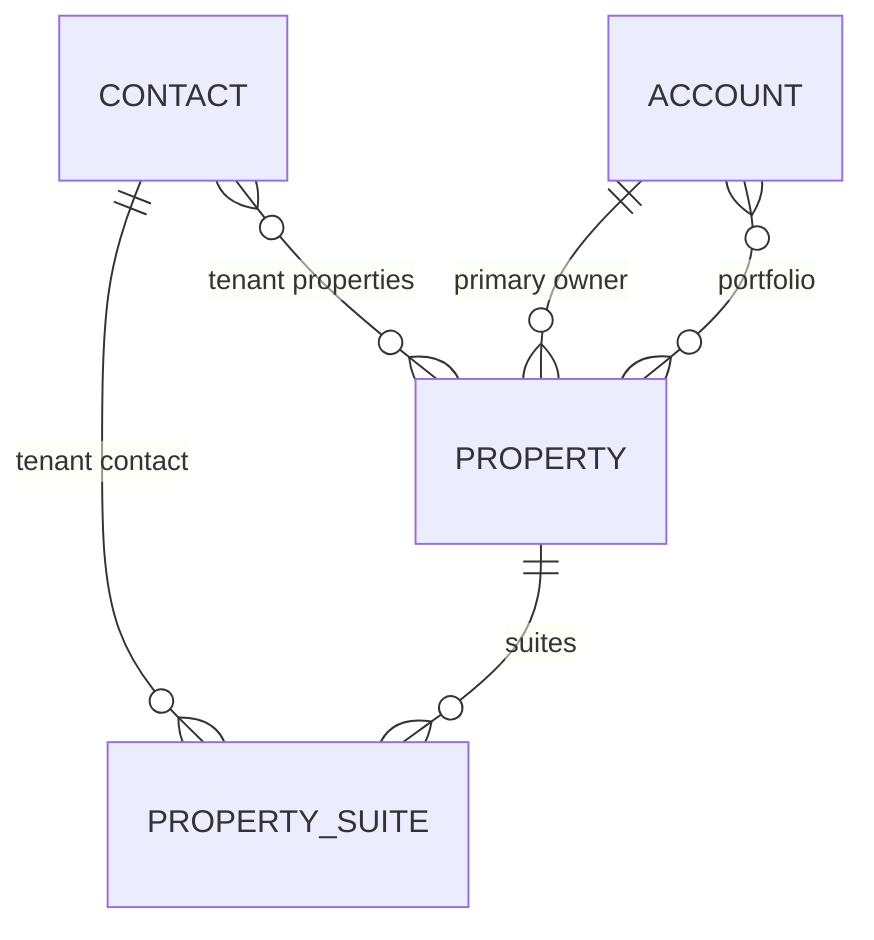

# CRE Relationship Management — Dataverse Configuration

Commercial real estate (CRE) relationship management model for Dynamics 365 / Dataverse.

## Solution components

| Component | Description |
| --- | --- |
| `config/cre-metadata.json` | Source of truth for option sets, fields, entities, and relationships |
| `config/cre-views.json` | Saved view catalog |
| `views/*.fetchxml` | FetchXML definitions for saved queries |
| `scripts/deploy-cre-model.py` | Web API deployment automation |
| `scripts/deploy-cre-solution.sh` | Authenticate and deploy |
| `solutions/CreRelationshipManagement/` | Managed solution project (`pac solution init`) |

## Contact entity extensions

### Relationship classifications (multi-select)

A contact may belong to multiple categories simultaneously:

- Broker, Landlord, Tenant, Investor, Developer, Property Manager, Asset Manager
- Lender, Attorney, Architect, Engineer, Vendor, Consultant, Municipality
- Economic Development, Franchisee, Franchise Development, Owner/User
- General Contractor, Government Agency

Field: `cre_relationshipclassifications`

### Professional designations (multi-select, searchable)

SIOR, CCIM, ICSC, CRE, CPM, RPA, LEED, NAIOP, ULI, BOMA, MBA, ALC

Field: `cre_professionaldesignations`

### Custom fields

| Field | Type | Purpose |
| --- | --- | --- |
| `cre_businessline` | Text | Business line |
| `cre_assignedbrokerid` | Lookup (User) | Assigned broker |
| `cre_marketsserved` | Memo | Markets served |
| `cre_geographiccoverage` | Memo | Geographic coverage |
| `cre_targetmarkets` | Memo | Target markets |
| `cre_propertypreferences` | Memo | Property preferences |
| `cre_minsf` / `cre_maxsf` | Integer | SF range for tenant requirements |
| `cre_leaseexpirationdate` | Date | Lease expiration |
| `cre_renewaltimeline` | Choice | Renewal timeline |
| `cre_referralsource` | Text | Referral source |
| `cre_relationshiptier` | Choice | A / B / C / D tier |
| `cre_lastmeaningfulcontact` | Date | Last meaningful contact |
| `cre_preferredcommunicationmethod` | Choice | Email, Phone, Text, LinkedIn, In Person |
| `cre_sociallinkedin` / `cre_socialtwitter` | URL | Social links |
| `cre_tags` | Memo | Tags (searchable) |

## Account entity extensions

### Classifications (multi-select)

Tenant, Landlord, Developer, REIT, Investment Group, Family Office, Franchise, Brokerage, Municipality, Property Owner, Vendor, Lender, Contractor

Field: `cre_accountclassifications`

### Custom fields

| Field | Type |
| --- | --- |
| `cre_portfoliosf` | Integer |
| `cre_markets` | Memo |
| `cre_industries` | Memo |
| `cre_naicscode` | Text |
| `cre_multipleofficelocations` | Boolean |

## Property entity (`cre_property`)

### Property information

Address fields, county, market, submarket, property type, ownership notes, assigned broker, status

### Building information

Building SF, land area, occupancy %, parking ratio, construction year, zoning

### Leasing information

Available suites, lease rate, operating expenses, tenant improvements, leasing status

### Ownership

Primary owner (account), property manager, asset manager

## Property Suite entity (`cre_propertysuite`)

Multi-tenant support: suite number, floor, suite area, tenant contact/account, lease dates, renewal options, vacancy flag

## Relationships

| Relationship | Type | Purpose |
| --- | --- | --- |
| Account → Property (primary owner) | 1:N | Landlord portfolio |
| Property → Property Suite | 1:N | Suite roster / stacking |
| Contact ↔ Property | N:N | Tenant ↔ properties |
| Account ↔ Property | N:N | Portfolio linkage |

## Saved views

| View | Entity | File |
| --- | --- | --- |
| Tenant requirements by SF | Contact | `contact-tenant-requirements-by-sf.fetchxml` |
| Lease expirations (6/12/18 mo) | Contact | `contact-lease-expirations-*.fetchxml` |
| Stale contacts (Tier A/B, 60+ days) | Contact | `contact-stale-tier-ab.fetchxml` |
| Available listings | Property | `property-available-listings.fetchxml` |
| Landlord portfolio by owner | Property | `property-landlord-portfolio.fetchxml` |
| SIOR members | Contact | `contact-sior-members.fetchxml` |

## Deployment

### Prerequisites

1. Dynamics 365 environment with Dataverse
2. Service principal with system administrator or equivalent privileges
3. Environment secrets configured in Cloud Agent:
   - `AZURE_TENANT_ID`
   - `AZURE_CLIENT_ID`
   - `AZURE_CLIENT_SECRET`
   - `DATAVERSE_ENVIRONMENT_URL`

### Deploy metadata

```bash
./scripts/deploy-cre-solution.sh
```

Or deploy metadata only:

```bash
python3 ./scripts/deploy-cre-model.py
```

### Import saved views

After deployment, create saved queries in Power Apps maker portal using the FetchXML files under `views/`, or import via solution sync:

```bash
pac auth create --environment "$DATAVERSE_ENVIRONMENT_URL" \
  --applicationId "$AZURE_CLIENT_ID" \
  --clientSecret "$AZURE_CLIENT_SECRET" \
  --tenant "$AZURE_TENANT_ID" \
  --name cloud-agent

pac solution sync
```

### Email-to-lead cloud flow

When an email arrives at **sandeep@stw-services.com** with **new lead** in the subject, the flow **CRE - Email New Lead to CRM** creates a row in the standard **Lead** table.

Deploy:

```bash
python3 ./scripts/deploy-cre-lead-flow.py
```

Configuration: `config/cre-email-lead-flow.json` (mailbox address, subject filter, connection references).

**One-time activation in Power Automate:**

1. Open **Solutions** → **CRE Relationship Management** → **CRE - Email New Lead to CRM**
2. Edit the flow and sign in to **Office 365 Outlook** and **Microsoft Dataverse** connections
3. Save and turn the flow **On**

If `sandeep@stw-services.com` is a user mailbox (not shared), set `"type": "user"` under `mailbox` in `config/cre-email-lead-flow.json` and redeploy.

### Post-deployment

1. Add fields to Contact, Account, and Property forms
2. Enable columns in advanced find / filter panels
3. Configure quick find on designation and classification fields
4. Create model-driven app or add tables to existing CRE app
5. Set security roles for brokers, analysts, and admins

## Architecture


